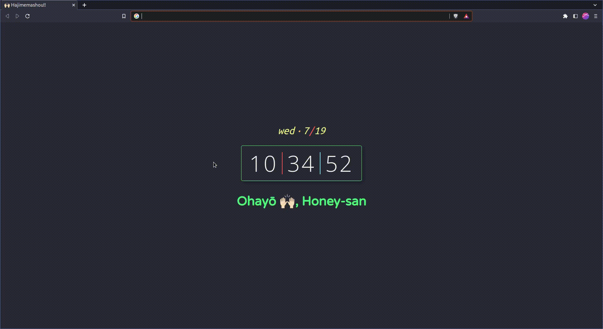

# Chromepage Dracula 🧛🏻

💫 Personalized override of Karenying's chromepage that matches with my current DE & Browser theme.

💜 Theme consistent with my personal desktop config (Arch Linux + i3wm).

🚀 See a live demo [here](https://amaaeltyrneamitore.github.io/chromepage-dracula/).

## Installation
1. Clone this repo.
2. Head over to Chrome Extensions (usually `chrome://extensions` in the address bar) and turn "Developer Mode" on the top left.
3. Click "Load unpack" and select the destination as this cloned repository.
